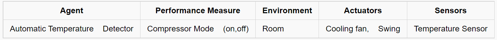
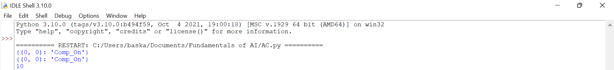

# Developing AI Agent with PEAS Description

## AIM:

To find the PEAS description for the given AI problem and develop an AI agent.

## THEORY:
AC Sensors checks the room temperature frequently.It is in undercontrol(less than specified temperature),compressor moves to off status.

## PEAS DESCRIPTION:


## DESIGN STEPS
### STEP 1:
The input of the AI agent is Temperature Sensor.

### STEP 2:
The output of the AI agent is if the temperature is less than the normal temperature-Compressor off mode and if the temperature is more than the normal temperature-Compressor on mode.

### STEP 3:
Agent:Automatic Temperature Detector
Performance Measure:Compressor Mode(On,Off)
Environment:Room
Actuators:Cooling fan,Swing
Sensors:Temperature Sensor

### STEP 4:
The agent analyse the environment(room) temperature and make the Compressor turns on or off.

### STEP 5:
The performance is measured with the room temperature and the action is observed.

## PROGRAM:
```
import random

class Thing:
    """
        This represents any physical object that can appear in an Environment.
    """

    def is_alive(self):
        """Things that are 'alive' should return true."""
        return hasattr(self, 'alive') and self.alive

    def show_state(self):
        """Display the agent's internal state. Subclasses should override."""
        print("I don't know how to show_state.")


class Agent(Thing):
    """
        An Agent is a subclass of Thing
    """

    def __init__(self, program=None):
        self.alive = True
        self.performance = 0
        self.program = program

    def can_grab(self, thing):
        """Return True if this agent can grab this thing.
        Override for appropriate subclasses of Agent and Thing."""
        return False

def TableDrivenAgentProgram(table):
    """
    This agent selects an action based on the percept sequence.
    It is practical only for tiny domains.
    To customize it, provide as table a dictionary of all
    {percept_sequence:action} pairs.
    """
    percepts = []

    def program(percept):
        action =None
        percepts.append(percept)
        action=table.get(tuple(percepts))
        return action

    return program

loc = (0, 0)


def TableDrivenCompressorAgent():
    """
    Tabular approach towards adjusting room temperature
    """
    table = {((loc, 'Comp_On'),): 'Cool',
             ((loc, 'Comp_Off'),): 'Hot',
             ((loc, 'Comp_On'), (loc, 'Comp_On')): 'Cool',
             ((loc, 'Comp_On'), (loc, 'Comp_Off')): 'Hot',
             ((loc, 'Comp_Off'), (loc, 'Comp_On')): 'Cool',
             ((loc, 'Comp_Off'), (loc, 'Comp_Off')): 'Hot',}
            
    return Agent(TableDrivenAgentProgram(table))


class Environment:
    """Abstract class representing an Environment. 'Real' Environment classes
    inherit from this. Your Environment will typically need to implement:
        percept:           Define the percept that an agent sees.
        execute_action:    Define the effects of executing an action.
                           Also update the agent.performance slot.
    The environment keeps a list of .things and .agents (which is a subset
    of .things). Each agent has a .performance slot, initialized to 0.
    Each thing has a .location slot, even though some environments may not
    need this."""

    def __init__(self):
        self.things = []
        self.agents = []

    def percept(self, agent):
        """Return the percept that the agent sees at this point. (Implement this.)"""
        raise NotImplementedError

    def execute_action(self, agent, action):
        """Change the world to reflect this action. (Implement this.)"""
        raise NotImplementedError

    def default_location(self, thing):
        """Default location to place a new thing with unspecified location."""
        return None

    def is_done(self):
        """By default, we're done when we can't find a live agent."""
        return not any(agent.is_alive() for agent in self.agents)

    def step(self):
        """Run the environment for one time step. If the
        actions and exogenous changes are independent, this method will
        do. If there are interactions between them, you'll need to
        override this method."""
        if not self.is_done():
            actions = []
            for agent in self.agents:
                if agent.alive:
                    actions.append(agent.program(self.percept(agent)))
                else:
                    actions.append("")
            for (agent, action) in zip(self.agents, actions):
                self.execute_action(agent, action)

    def run(self, steps=1000):
        """Run the Environment for given number of time steps."""
        for step in range(steps):
            if self.is_done():
                return
            self.step()

    def add_thing(self, thing, location=None):
        """Add a thing to the environment, setting its location. For
        convenience, if thing is an agent program we make a new agent
        for it. (Shouldn't need to override this.)"""
        if not isinstance(thing, Thing):
            thing = Agent(thing)
        if thing in self.things:
            print("Can't add the same thing twice")
        else:
            thing.location = location if location is not None else self.default_location(thing)
            self.things.append(thing)
            if isinstance(thing, Agent):
                thing.performance = 0
                self.agents.append(thing)

    def delete_thing(self, thing):
        """Remove a thing from the environment."""
        try:
            self.things.remove(thing)
        except ValueError as e:
            print(e)
            print("  in Environment delete_thing")
            print("  Thing to be removed: {} at {}".format(thing, thing.location))
            print("  from list: {}".format([(thing, thing.location) for thing in self.things]))
        if thing in self.agents:
            self.agents.remove(thing)


class TrivialCompressorEnvironment(Environment):
    """This environment has a location. Room can be Cool or Hot. The agent perceives its location and the location's
    status. This serves as an example of how to implement a simple
    Environment."""

    def __init__(self):
        super().__init__()
        self.status = {loc: random.choice(['Comp_On', 'Comp_Off'])}
                       

    def thing_classes(self):
        return [ TableDrivenCompressorAgent]

    def percept(self, agent):
        """Returns the agent's location, and the location status (Cool/Hot)."""
        return agent.location, self.status[agent.location]

    def execute_action(self, agent, action):
        """Change agent's location and/or location's status; track performance.
        Score 10 for each Compressor On; -5 for Compressor Off ."""
        if action=='Cool':
            agent.location = loc
            agent.performance +=10
        elif action=='Hot':
            agent.location = loc
            agent.performance -=5
       
    def default_location(self, thing):
        """Agents start in either location at random."""
        return random.choice([loc])

if __name__ == "__main__":
    agent = TableDrivenCompressorAgent()
    environment = TrivialCompressorEnvironment()
    environment.add_thing(agent)
    print(environment.status)
    environment.run(steps=1)
    print(environment.status)
    print(agent.performance)
```

## OUTPUT:


## RESULT:
Thus, an AI agent was developed with PEAS description.

